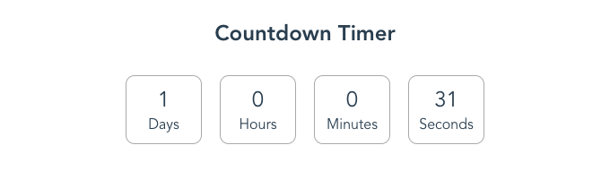

# Countdown

**A simple countdown timer**



## Usage

```html
<count-down
  :initialDays="1"
  :initialHours="23"
  :initialMinutes="27"
  :initialSeconds="47">
</count-down>
```

```js
<script>
  import CountDown from '@/components/CountDown.vue'

  export default {
    components: { 
      CountDown 
    }
  }
</script>
```

### Parameters

| Input | Type | Required |Default |
| :---: | :---: | :---: |:---: |
| `initialDays` | Number | false | 0 |
| `initialHours` | Number | false | 0 |
| `initialMinutes` | Number | false | 0 |
| `initialSeconds` | Number | false | 0 |

### Note:

You can omit one or all the attributes from the Countdown componente definition, it would take the default values shown in the previously table.

**For example:**  

Counter Value = `2 Days 20 Minutes 10 Seconds`

```html
<count-down
  :initialDays="2"
  :initialMinutes="20"
  :initialSeconds="10">
</count-down>
```

## Project setup
```
yarn install
```

### Compiles and hot-reloads for development
```
yarn run serve
```

### Compiles and minifies for production
```
yarn run build
```

[](https://asciinema.org/a/195513)
